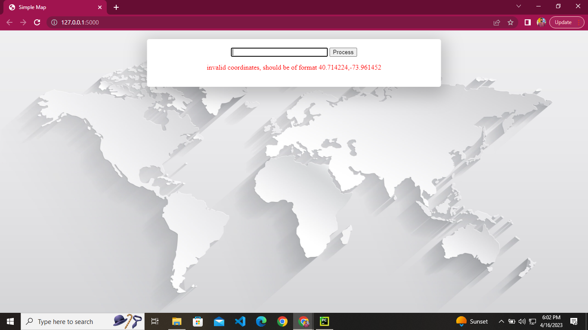
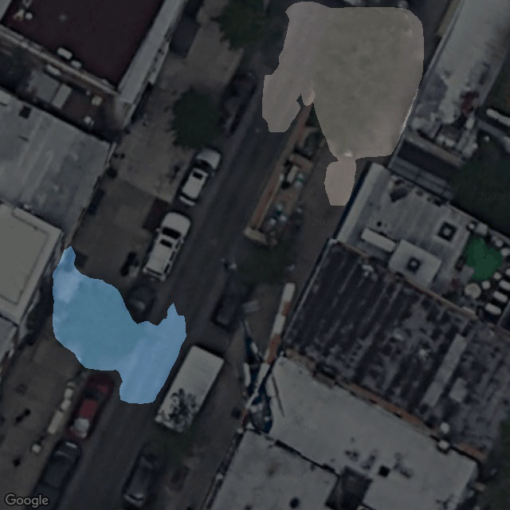
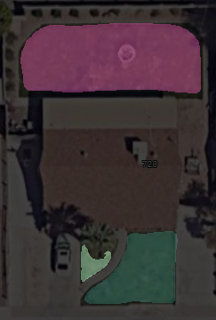

# lawn calculation app.

### Description

Basically it is the webb app that use the google apis map api that capture the images using the longitude and latitude then use AI instance segmentation model
**Mask_RCNN** to detect the lawn in that image. The scope that project is to facilitate user check there neighbours house that they have lawn or not if yes then how many area is cover by lawn here is the simple interface of that web app.

# Installations

Make your python environment with python 3.6.

After that install the project requirements with command`pip install -r requirement.txt`. 

Download the maskrcnn weights  from [HERE](https://drive.google.com/drive/folders/19c5hOR14lrfxqUWw8QtmSKjP2CILb8xz?usp=sharing)and put in weights folder.

create your googke developer account and  get your api key from ther and place it to processor.py **line no 25** and save it.

# how to run
If all the installation has been done then open the console or terminal and command `python processor.py` url will be shown on terminal and hit the url web app page will be shown.

#Results

